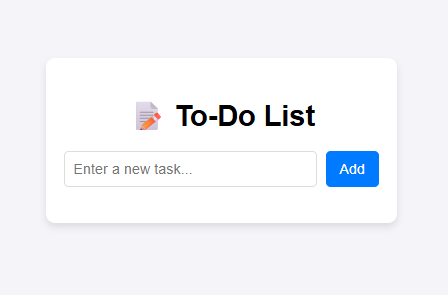

# 📝 To-Do List App

A simple To-Do List application built with *HTML, CSS, and JavaScript*.  
It allows users to add, complete, and delete tasks. Tasks are saved in *local storage* so they remain even after refreshing the page.

---

## 🚀 Features
- Add new tasks
- Mark tasks as completed (click to toggle)
- Delete tasks
- Save tasks in browser local storage
- Clean and responsive UI

---

## 📂 Project Structure

---

## 📸 Screenshot

---

## 🌐 Live Demo
[👉 Click here to try the To-Do List App](https://xyzvikram.github.io/todo-list-app/)

---

## ⭐ Support
If you like this project, don’t forget to *star* ⭐ the repository!
